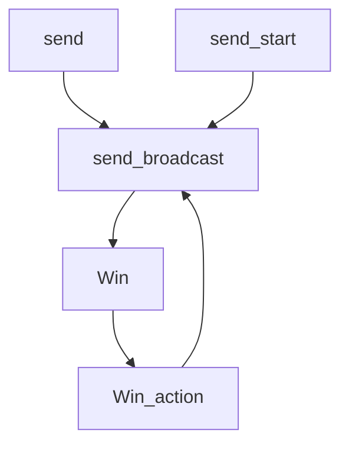

# LineBot-Prototype
LineBot-Prototype

# LineBot - Instant Win Game

##   purpose
 
	Lineビジネスでインスタントウィンゲームなどの実装が実際に可能かどうか調査
	開発期間またはPrototypeの確認

## 機能

	 1. Lineビジネスでのインスタントウィンゲーム
	 2. Lineビジネスでボットがメッセージにメッセージ伝達
	 
## 予想開発環境
	Centos6 - 理由 - Zサーバーに合わせるために。
	PHP - 理由 - Zサーバーに合わせるために
	
## 予想期間及び必要作業
	要件定義が必要なので開発期間が確定しない。

## Prototype v1 Instant Win Game

